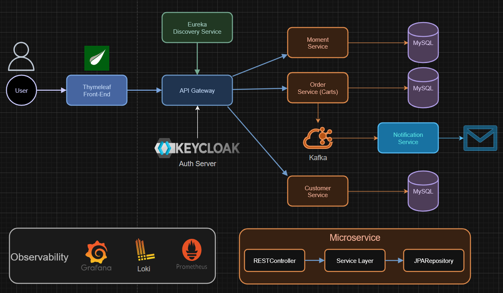
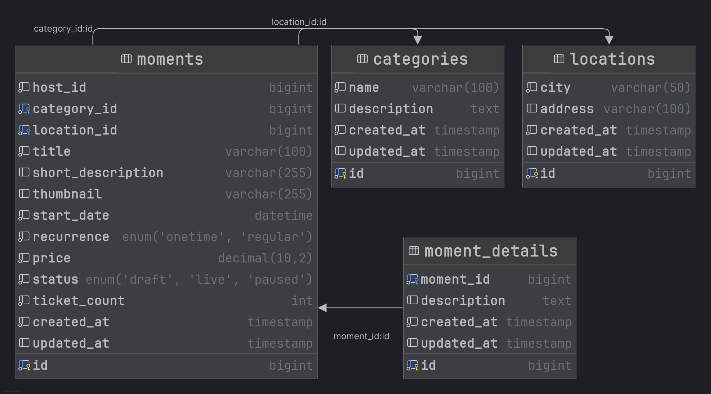
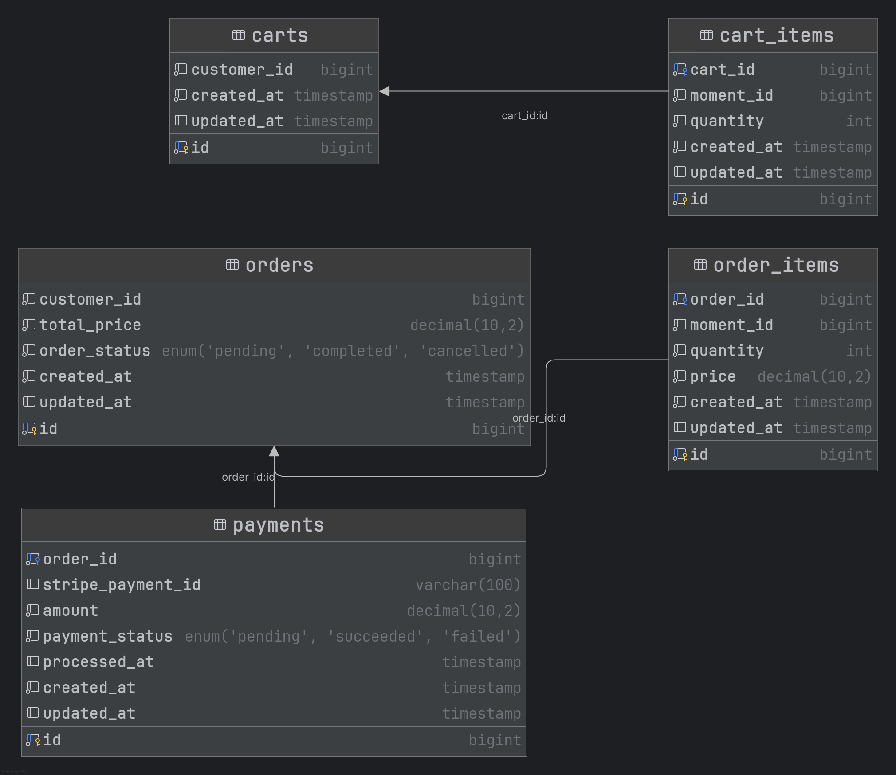
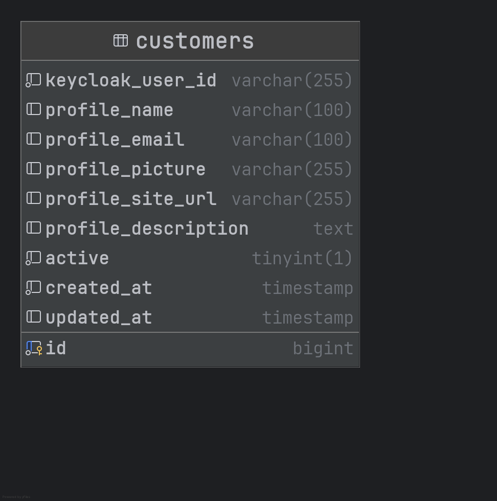

# Moments Event Platform

Welcome to the **Moments Event Platform** repository! This is a fully-featured eCommerce solution for building scalable, customizable, and high-performance event system for hosting your own, finding and attending the events of others. It supports everything you need for event management, secure order system, user authentication and to showcase events. The platform is designed with a modular microservice architecture, making it easy to extend and integrate with other systems.

## Table of Contents

1. [Project Overview](#project-overview)
2. [Features](#features)
3. [Technologies Used](#technologies-used)
4. [Architecture](#architecture)
5. [System Design](#system-design)
6. [Setup and Installation](#setup-and-installation)
7. [Folder Structure](#folder-structure)
8. [API Documentation](#api-documentation)
9. [Contributing](#contributing)
10. [License](#license)

## Project Overview

The **Moments Event Platform** is a robust solution for creating and managing online event hosting and ticket sales. It offers everything required for modern eCommerce businesses: from handling event listings, processing customer orders, and managing stock, to user authentication and payments.

This platform supports:

* Event listing and detailed event profile/status management
* Secure payment processing planned for the future (via Stripe)
* A highly scalable and feature-stable cloud architecture
* Real-time order tracking
* User accounts with personalized dashboard and profile
* Advanced event search, filtering, sorting, and pagination
* Fully responsive design for mobile and desktop using Bootstrap

## Features

### Event Management

* **Create, update, and delete events**: Users can add new events, update existing event details, and remove obsolete events.
* **Categorize events**: Events can be grouped by categories (e.g. Art, Music, Food & Comedy).
* **Advanced filtering and sorting**: Users can sort products by date, city, title, price, category or recurrence.

### User Authentication & Authorization

* **Role-based access control**: Users and admin have different roles with different permissions.
* **Login securely**:  over Keycloak supporting OpenID Connect (OIDC) and OAuth 2 industry standards.
* **Password hashing**: Users' passwords are securely hashed using industry-standard algorithms.
* **Email verification**: Users must verify their email upon registration before they can make purchases.

### Shopping Cart & Checkout

* **Add/remove items**: Users can easily add or remove items from their cart.
* **Adjust quantities**: Customers can modify the quantity of items in their cart.
* **Real time ticket stock**: Ticket availability shown in cart before ordering.
* **Order confirmation**: Displays the final price, including taxes, shipping costs, and applied discounts.
* **Email notification**: After ordering a message is sent to the users email address with the order.

<!--- ### Order Management

* **Track orders**: Both customers and admins can track orders through every stage (processing, shipped, delivered).
* **Generate invoices**: Invoices are generated automatically and emailed to customers after successful purchase.
* **Returns & Refunds**: Users can initiate returns, and admins can approve or deny them.
* **Order history**: Customers can view all their past orders and statuses.

### Payment Gateway Integration

* **Multiple payment methods**: Supports Stripe (credit/debit cards) and PayPal for payment processing.
* **Secure transactions**: PCI-compliant and fully encrypted payment system.
* **Currency conversion**: Built-in support for handling multiple currencies.
* **Tax calculation**: Dynamic tax calculation based on user location.

### Analytics Dashboard

* **Sales performance**: Track total sales, daily/weekly/monthly revenue, and best-selling products.
* **User activity**: See which users are active, when they registered, and what products they’ve purchased.
* **Product performance**: View which products are frequently purchased, have the highest reviews, and are most popular.

### Customer Support Integration

* **Contact support**: Customers can directly contact support teams for assistance via email or live chat.
* **Help Center**: A knowledge base where customers can find answers to common questions. --->

## Technologies Used

replace part with oru technologies HERE

<!-- ### **Backend**

* **Node.js**: A non-blocking, event-driven server for handling large-scale requests.
* **Express.js**: A minimal web framework to handle routing and middleware.
* **MongoDB**: A NoSQL database that allows for flexible data modeling (products, orders, users, etc.).
* **JWT (JSON Web Tokens)**: Used for user authentication and token-based authorization.
* **Mongoose**: An ODM (Object Data Modeling) library to interact with MongoDB, ensuring a clear structure for data.

### **Frontend**

* **React.js**: A JavaScript library for building dynamic, component-based user interfaces.
* **Redux**: A state management library to manage the application state centrally.
* **Sass**: A CSS preprocessor for maintaining scalable styles.
* **Axios**: For HTTP requests to the backend API.
* **React Router**: For dynamic navigation and route handling in the frontend. -->

### **Third-Party Services**

* **Mailtrap**: For email notifications (order confirmations).
* **Docker**: For containerizing the platform and making deployment easier.
* **Stripe**: The platform is planned and developed with Stripe integration in mind.

## Architecture

The platform follows a **Microservices Architecture** with each service being responsible for a specific feature:

### **Microservices Breakdown:**

* **Moment Service**:

  * Manages event data: event creation, updating, removal, and categorization.
  * Stores event details like price, description, stock, etc.
  * Analytics such as event count by categories and cities.

* **Order Service**:

  * Handles the entire order lifecycle: from managing items in the shopping cart system to the actual order.
  * Takes care of order creation, payment processing, order status and confirmation.
  * Confirmation is done both on the website and securely via email.
  <!-- * Communicates with payment gateways like **Stripe** and **PayPal** for secure transactions.
  * Interfaces with third-party providers like **Stripe** and **PayPal** to process payments securely. -->

* **Customer Service**:

  * Authenticates and authorizes users via **JWT tokens**.
  * Stores and edits user profile.
  * Offers role-based access control (admin, user).

* **Notification Service**:

  * Handles email notifications (via **Mailtrap**) for order confirmations.

### **System Design Diagram:**

Below is a high-level system design diagram showcasing the different services and how they interact:



## System Design

### API Gateway:

* An API Gateway is used to route API requests to appropriate services. This provides a single entry point for external requests and helps with load balancing, security, and performance.

### Eureka Naming Server:

* For service discovery, to know addresses of microservice instances dynamically.

### Keycloak:

* Secure OAuth 2.0 and OpenID Connect (OIDC) server for both login and user registration with verified email.

### Kafka, Zookeeper, Kafka UI, Avro, Schema registry:

* To publish from order service, store and sent messages to the notification service, which in turn sends an email to the user with Javamail using Mailtrap.

### Database Design:

* **Customers**:  
 Stores customer profiles, linking users via their Keycloak identity. Includes details like name, email, profile picture, personal website URL, and a short description. Tracks account activity status and timestamps for creation and updates.
* **Moments**:  
 Represents events or moments created by users. Contains information such as title, short description, thumbnail, pricing, ticket count, scheduling (including recurrence), and status (e.g., draft, live). Each moment is linked to a host, a category, and a location.
* **Moment Details**:  
 Holds extended descriptions for each moment, allowing richer content separate from the core moment data. Tracks creation and update timestamps and links directly to the corresponding moment.
* **Categories**:  
 Maintains a catalog of moment categories, with each entry including a name and an optional description. Used to classify moments/events.
* **Locations**:  
 Defines geographic locations for moments. Includes city and address fields. Used to assign a specific place to each event.
* **Carts**:  
 Represents shopping carts created by customers. Each cart belongs to a specific customer and tracks its creation and update times.
* **Cart Items**:  
 Tracks the contents of each cart, linking individual moments (events) with quantities to specific carts. Supports the process of assembling orders before purchase.

### Database Schema Diagrams:

* Moment Service Database Schema

<div align="center">
  
</div>
<br>

* Order Service Database Schema

<div align="center">
  
</div>
<br>

* Customer Service Database Schema

<div align="center">
  
</div>
<br>

## Setup and Installation

### 1. Clone the Repository

```bash
git clone https://github.com/YourUsername/eCommerce-Platform.git
cd eCommerce-Platform
```

### 2. Install Dependencies

Run the following commands to install the dependencies for both the frontend and backend:

```bash
# Backend dependencies
cd backend
npm install

# Frontend dependencies
cd ../frontend
npm install
```

### 3. Configure Environment Variables

Create a `.env` file in the root of the project directory and fill it with the required environment variables for database connection, JWT secret, payment keys, etc.

Example `.env` file:

```env
DB_URI=mongodb://localhost:27017/ecommerce-platform
JWT_SECRET=your-secret-key
STRIPE_SECRET_KEY=your-stripe-secret-key
SENDGRID_API_KEY=your-sendgrid-api-key
PORT=3000
```

### 4. Run the Application

Start the backend and frontend services in separate terminal windows:

```bash
# Backend
cd backend
npm start

# Frontend
cd frontend
npm start
```

The backend will be running at `http://localhost:3000`, and the frontend at `http://localhost:3001`.

## Folder Structure

The project

is organized in a modular manner:

```
eCommerce-Platform/
├── backend/                  # Backend API code
│   ├── controllers/          # Logic for handling incoming API requests
│   ├── models/               # Database models (Mongoose schemas)
│   ├── routes/               # API route definitions
│   ├── services/             # Business logic for each service (Product, Order, User)
│   ├── config/               # Configuration files (DB, payment gateways, etc.)
│   └── utils/                # Utility functions and helpers
├── frontend/                 # Frontend code (React)
│   ├── components/           # UI components (buttons, modals, etc.)
│   ├── pages/                # Pages (Home, Product Detail, Checkout, etc.)
│   ├── redux/                # Redux store and reducers
│   └── public/               # Static assets (images, fonts, etc.)
├── .env                      # Environment variables
├── README.md                 # Project documentation
└── package.json              # Project dependencies
```

## API Documentation

The API exposes various endpoints for handling products, orders, users, and payments.

* **POST** `/api/auth/register`: Registers a new user
* **POST** `/api/auth/login`: Logs in a user and returns a JWT token
* **GET** `/api/products`: Fetches a list of products
* **POST** `/api/products`: Creates a new product (admin only)
* **PUT** `/api/products/:id`: Updates a product (admin only)
* **DELETE** `/api/products/:id`: Deletes a product (admin only)

## Contributing

We welcome contributions to this project! Whether it's bug fixes, feature additions, or documentation improvements, your help is appreciated.

## License

This project is licensed under the **MIT License**. See the [LICENSE](./LICENSE) file for more information.
